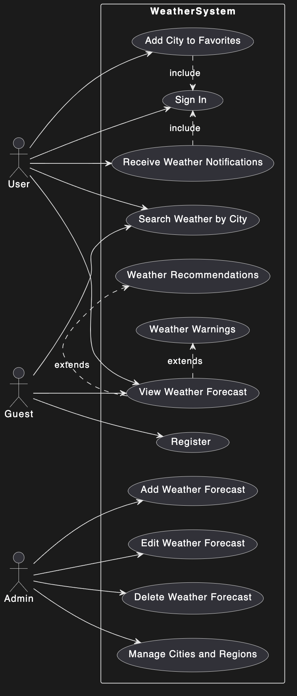
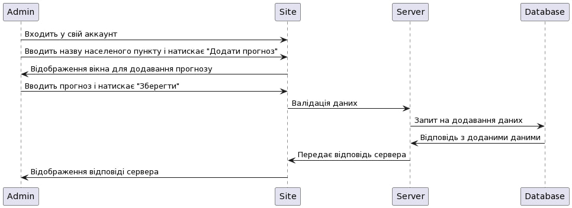
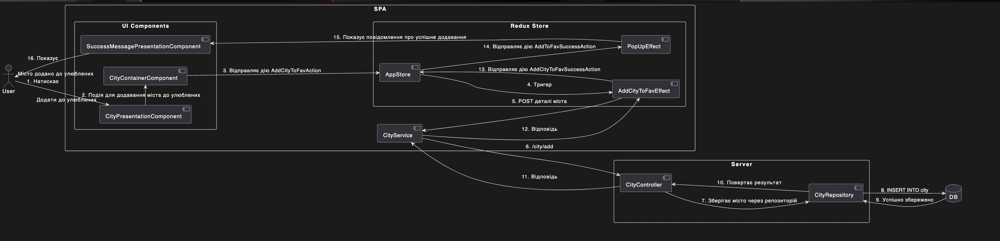
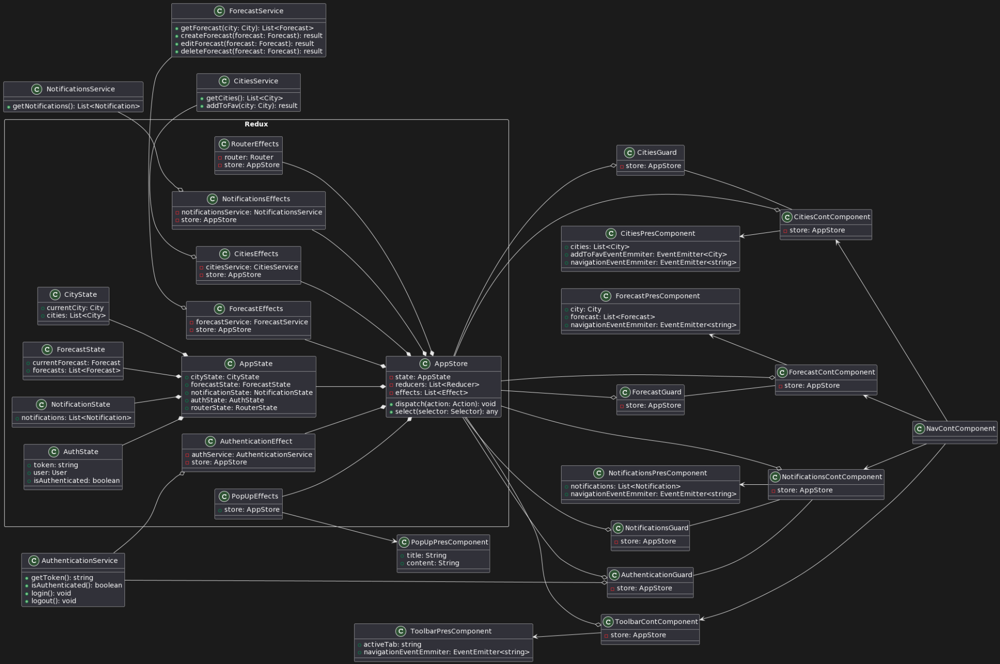

# Проект прогнозу погоди

## Передмова

У цьому проекті ми, Молчанов Михайло, Запорожченко Анастасія, Глухов Іван та Пуртова Аліна, розробимо, спроектуємо та реалізуємо систему прогнозу погоди. Основною метою цього проекту є створення зручного та функціонального інструменту для отримання актуальної інформації про погоду в різних містах. Сучасний світ технологій вимагає надійних та ефективних рішень для отримання даних, і ми прагнемо створити саме таку систему, яка буде відповідати всім вимогам сучасних користувачів.

Ми починаємо цей проект з глибокого розуміння необхідності інтеграції найкращих практик програмування та використання UML для проектування системи. Це дозволить нам створити продукт, який буде не лише функціональним, але й легко підтримуваним та масштабованим. Наш підхід до розробки передбачає детальне планування кожного етапу, починаючи з визначення вимог і закінчуючи тестуванням та впровадженням системи.

На початковому етапі ми спільно продумаємо архітектуру та функціональність системи. Цей процес включатиме вивчення аналогів, визначення ключових функціональних вимог та створення UML діаграм для візуалізації структури та поведінки системи. Нашою метою є забезпечення максимальної прозорості та зрозумілості проекту для всіх учасників команди, що дозволить ефективно розподілити завдання та уникнути непорозумінь у майбутньому.

Процес розробки буде включати кілька основних етапів. Спочатку ми створимо прототип системи, який дозволить нам перевірити основні гіпотези та отримати зворотний зв'язок від потенційних користувачів. Це важливо для виявлення можливих проблем на ранньому етапі та їх швидкого виправлення. Після цього ми перейдемо до безпосередньої розробки системи, де кожен з нас буде відповідати за свою частину роботи. Ми будемо регулярно проводити зустрічі для обговорення прогресу та вирішення можливих проблем.

Ми також плануємо інтегрувати систему з різними зовнішніми сервісами для отримання актуальних даних про погоду. Це дозволить нам забезпечити високу точність прогнозів та їх своєчасне оновлення. Використання API допоможе нам досягти цієї мети.

Наш проект також передбачає забезпечення високого рівня безпеки даних. Ми впровадимо всі необхідні заходи для захисту даних користувачів, включаючи використання сучасних методів шифрування та захисту від найпоширеніших загроз, таких як SQL-ін'єкції та CSRF-атаки. Ми розуміємо важливість забезпечення конфіденційності та безпеки даних, і це буде одним з наших пріоритетів під час розробки системи.

Ми також плануємо створити детальну документацію для системи, яка включатиме опис архітектури, основних компонентів та їх взаємодії, а також інструкції для розробників та користувачів. Це допоможе нам забезпечити легку підтримку та розвиток системи у майбутньому. Документація буде створюватися паралельно з розробкою, щоб забезпечити її актуальність та точність.

Наш проект передбачає використання сучасних підходів до управління проектами. Це дозволить нам швидко реагувати на зміну вимог та забезпечити високий рівень гнучкості під час розробки. Ми будемо працювати в коротких ітераціях, що дозволить нам постійно отримувати зворотний зв'язок та вносити необхідні корективи. Це також допоможе нам зберегти високий рівень мотивації та залученості команди.

Таким чином, ми плануємо реалізувати систему прогнозу погоди, яка буде відповідати всім сучасним вимогам та забезпечувати високий рівень точності та надійності. Наш підхід до розробки включає детальне планування, використання UML для проектування, дотримання найкращих практик програмування, забезпечення безпеки даних, створення детальної документації та активне тестування. Ми впевнені, що ці заходи дозволять нам створити якісний продукт, який задовольнить потреби наших користувачів та стане надійним інструментом для отримання актуальної інформації про погоду.

## Що повинна робити система в концептуальному плані

### Діаграма прецедентів

Код діаграми [тут](./docs/diagrams/use-cast.pumld)

Діаграма прецедентів, зображена на Рисунку 1, є одним з ключових елементів у проектуванні нашої системи прогнозу погоди. Діаграма прецедентів (use case diagram) - це діаграма, яка відображає взаємодію користувачів (акторів) з системою та перелік функцій (прецедентів), які система виконує. Вона дозволяє візуалізувати вимоги до системи та зрозуміти, як різні типи користувачів будуть взаємодіяти з системою.

### Навіщо потрібна діаграма прецедентів

Діаграма прецедентів необхідна для кількох важливих цілей:

1. Визначення вимог до системи: Вона допомагає зрозуміти, які функції повинні бути реалізовані в системі з точки зору кінцевого користувача.
2. Аналіз взаємодії: Діаграма відображає взаємодію різних користувачів із системою, що допомагає розробникам зрозуміти, які саме дії виконуватимуть користувачі.
3. Полегшення комунікації: Вона слугує візуальним інструментом для обговорення вимог та функцій системи між командою розробників, замовниками та іншими зацікавленими сторонами.
4. Основи для тестування: Діаграма прецедентів використовується для створення тестових сценаріїв, що допомагає забезпечити відповідність функціональних вимог під час тестування системи.

### Спільне обговорення та проектування

Ця діаграма була спільно обговорена та розроблена всіма членами нашої команди, а саме Молчановим Михайлом, Запорожченко Анастасією, Глуховим Іваном та Пуртовою Аліною. Ми ретельно аналізували всі можливі сценарії використання системи та визначали основні функції, які повинні бути реалізовані для забезпечення користувачів актуальною та точною інформацією про погоду.

### Загальний опис діаграми

На діаграмі прецедентів на Рисунку 1 зображені три основні типи користувачів: Гість, Користувач та Адміністратор. Кожен з цих користувачів має різні рівні доступу та можливості в системі.

- Гість:
  - Може переглядати прогнози погоди.
  - Має можливість зареєструватися в системі.
  - Може шукати погоду за містом.

- Користувач:
  - Може виконувати всі дії, доступні гостю.
  - Може додавати міста до улюблених.
  - Може отримувати сповіщення про погоду.
  - Може отримувати попередження про погоду.
  - Може отримувати рекомендації про погоду.

- Адміністратор:
  - Може виконувати всі дії, доступні користувачу.
  - Має можливість додавати прогнози погоди.
  - Має можливість редагувати прогнози погоди.
  - Має можливість видаляти прогнози погоди.
  - Має можливість керувати містами та регіонами.

### Опис прецедентів

1. View Weather Forecast (Перегляд прогнозу погоди): Доступний для всіх користувачів. Цей прецедент дозволяє переглядати прогноз погоди для обраного міста.
2. Register (Реєстрація): Доступний для гостей. Цей прецедент дозволяє зареєструватися в системі, щоб отримати доступ до додаткових функцій.
3. Add City to Favorites (Додавання міста до улюблених): Доступний для користувачів. Дозволяє додати обране місто до списку улюблених міст.
4. Receive Weather Notifications (Отримання сповіщень про погоду): Доступний для користувачів. Дозволяє отримувати сповіщення про зміну погоди у вибраних містах.
5. Search Weather by City (Пошук погоди за містом): Доступний для всіх користувачів. Дозволяє шукати прогноз погоди за назвою міста.
6. Weather Warnings (Попередження про погоду): Доступний для користувачів. Дозволяє отримувати попередження про несприятливі погодні умови.
7. Weather Recommendations (Рекомендації про погоду): Доступний для користувачів. Дозволяє отримувати рекомендації, засновані на погодних умовах.
8. Add Weather Forecast (Додавання прогнозу погоди): Доступний для адміністраторів. Дозволяє додавати нові прогнози погоди в систему.
9. Edit Weather Forecast (Редагування прогнозу погоди): Доступний для адміністраторів. Дозволяє редагувати існуючі прогнози погоди.
10. Delete Weather Forecast (Видалення прогнозу погоди): Доступний для адміністраторів. Дозволяє видаляти прогнози погоди.
11. Manage Cities and Regions (Керування містами та регіонами): Доступний для адміністраторів. Дозволяє керувати інформацією про міста та регіони в системі.

Ця діаграма є основою для подальшого проектування та розробки нашої системи прогнозу погоди. Вона допоможе нам зрозуміти основні функції системи та взаємодію користувачів з нею, що є важливим кроком на шляху до створення ефективного та надійного програмного забезпечення.

## Загальні частини системи

У ході проектування та обговорення майбутньої системи прогнозу погоди ми продумали її основні складові частини. Наша система буде складатися з трьох головних компонентів, кожен з яких відіграватиме важливу роль у забезпеченні її функціональності та надійності.

### База даних

Першим ключовим компонентом системи є база даних. Ми вирішили використовувати реляційну базу даних, яка забезпечить структуроване зберігання даних про погоду, міста, користувачів та їхні вподобання. Реляційна база даних дозволить нам ефективно управляти великими обсягами даних та забезпечить швидкий доступ до необхідної інформації. Структура бази даних буде ретельно спроектована для забезпечення високої продуктивності та масштабованості системи.

### REST API сервіс

Другим важливим компонентом є REST API сервіс. Цей сервіс слугуватиме мостом між базою даних та клієнтськими додатками, забезпечуючи доступ до даних через стандартизовані HTTP-запити. REST API дозволить нам легко інтегрувати різні клієнтські додатки, забезпечуючи їм доступ до необхідної інформації про погоду. Ми плануємо реалізувати API, який буде підтримувати всі основні операції з даними, такі як створення, читання, оновлення та видалення.

### SPA (Single Page Application)

Третім компонентом нашої системи буде клієнтський додаток у вигляді SPA (Single Page Application). Це сучасний підхід до розробки веб-додатків, який дозволяє забезпечити високу інтерактивність та швидкість роботи. SPA буде надавати користувачам зручний інтерфейс для взаємодії з системою, включаючи можливість перегляду прогнозів погоди, додавання міст до улюблених, отримання сповіщень та інші функції. SPA буде взаємодіяти з REST API для отримання та відправлення даних, забезпечуючи швидку та ефективну роботу з системою.

### Загальна архітектура

Загальна архітектура системи буде побудована таким чином, щоб забезпечити високий рівень продуктивності, надійності та масштабованості. База даних, REST API сервіс та SPA будуть взаємодіяти між собою, забезпечуючи повний цикл обробки даних від їх зберігання до відображення користувачам.

#### Спільне обговорення

Ми, як команда, ретельно обговорювали кожен з цих компонентів та їхню взаємодію, щоб переконатися в їхньому ефективному функціонуванні. Кожен з нас вніс свій вклад у проектування системи, що дозволило врахувати різні точки зору та забезпечити оптимальне рішення для реалізації проекту.

#### Майбутні кроки

Після завершення етапу проектування ми перейдемо до реалізації кожного з компонентів системи. Ми будемо використовувати найкращі практики програмування та сучасні технології, щоб забезпечити високу якість та надійність кінцевого продукту. Кожен етап розробки буде супроводжуватися тестуванням та документуванням, щоб забезпечити повну відповідність системи вимогам та очікуванням користувачів.

Таким чином, наша система прогнозу погоди буде включати реляційну базу даних, REST API сервіс та клієнтський додаток у вигляді SPA. Ці компоненти забезпечать повний цикл обробки та відображення даних, дозволяючи користувачам легко отримувати актуальну інформацію про погоду та взаємодіяти з системою.

## Діаграми послідовностей

Діаграми послідовностей є важливим інструментом для проектування та документування динамічних аспектів системи. Вони використовуються для відображення взаємодії між об'єктами в певному часовому порядку, що дозволяє краще зрозуміти логіку та потоки даних у системі. Діаграми послідовностей допомагають розробникам та архітекторам системи візуалізувати та спланувати процеси, які відбуваються під час виконання конкретних функцій або випадків використання.

### Навіщо потрібні діаграми послідовностей

1. Візуалізація потоків даних: Діаграми послідовностей дозволяють чітко побачити, як дані передаються між різними компонентами системи, що спрощує розуміння складних процесів.
2. Аналіз взаємодії: Вони показують порядок виклику методів та обміну повідомленнями між об'єктами, що допомагає виявити потенційні проблеми та вузькі місця в логіці системи.
3. Документування процесів: Діаграми послідовностей є цінним джерелом документації, яке можна використовувати для навчання нових членів команди або для подальшої підтримки системи.
4. Полегшення комунікації: Вони служать інструментом для обговорення та узгодження деталей реалізації між розробниками, тестувальниками та іншими зацікавленими сторонами.

### Діаграма послідовностей для аутентифікації користувача

Код діаграми [тут](docs/diagrams/create-acc-seq.puml)

Рисунок 2 зображує діаграму послідовностей для процесу аутентифікації користувача, розроблену Молчановим Михайлом. Ця діаграма відображає всі ключові етапи взаємодії між користувачем, системою аутентифікації Auth0, веб-сайтом (Site), сервером та базою даних під час процесу реєстрації та аутентифікації користувача.

#### Опис діаграми

1. Користувач реєструється через Email або Google:
   - Користувач ініціює процес реєстрації, використовуючи свій електронний лист або обліковий запис Google.
   - Система аутентифікації Auth0 обробляє цей запит та перенаправляє користувача на веб-сайт (Site) з кодом аутентифікації (auth code).

2. Користувач отримує доступ до веб-сайту з кодом аутентифікації:
   - Користувач переходить на веб-сайт, передаючи код аутентифікації.
   - Веб-сайт відправляє цей код на сервер для подальшої обробки.

3. Сервер запитує токени, використовуючи код авторизації:
   - Сервер використовує отриманий код авторизації для запиту токенів у системі Auth0.
   - Auth0 повертає серверу необхідні токени.

4. Сервер створює або оновлює профіль користувача в базі даних:
   - Використовуючи отримані токени, сервер створює або оновлює профіль користувача в базі даних.
   - Після успішного збереження даних, сервер відправляє підтвердження на веб-сайт.

5. Веб-сайт відображає користувачу повідомлення про успішну реєстрацію:
   - Веб-сайт отримує підтвердження від сервера та відображає користувачу повідомлення про успішну реєстрацію.

Ця діаграма ілюструє, як різні компоненти системи взаємодіють між собою для забезпечення безпечної та ефективної аутентифікації користувачів. Вона допомагає зрозуміти весь процес від початку до кінця та виявити ключові етапи, на яких можуть виникнути потенційні проблеми.

Діаграма послідовностей, подібна до тієї, що зображена на Рисунку 2, є важливим кроком у процесі проектування системи. Вона дозволяє нам чітко бачити взаємодію між різними компонентами та забезпечує надійну основу для подальшої реалізації та тестування.

### Діаграма послідовностей для запиту та отримання нотифікацій

Код діаграми [тут](docs/diagrams/create-acc-seq.puml)

На Рисунку 3 зображена діаграма послідовностей для процесу запиту та отримання нотифікацій користувачем, розроблена Глуховим Іваном. Ця діаграма ілюструє, як відбувається взаємодія між користувачем, сайтом, сервером та базою даних під час отримання нотифікацій.

#### Опис діаграми

1. Користувач входить у свій аккаунт:
   - Користувач вводить свої облікові дані на сайті та здійснює вхід у систему.

2. Сайт відправляє запит на отримання нотифікацій з токеном клієнта:
   - Після успішної автентифікації сайт відправляє запит до сервера для отримання нотифікацій. Запит містить токен клієнта, який забезпечує безпечний доступ до даних користувача.

3. Сервер звертається до бази даних для отримання нотифікацій:
   - Сервер отримує запит з сайту та звертається до бази даних, щоб отримати нотифікації для конкретного користувача.
   - База даних відповідає серверу з необхідними нотифікаціями.

4. Сервер передає нотифікації сайту:
   - Сервер отримує нотифікації від бази даних та передає їх сайту.

5. Сайт показує нотифікації користувачу:
   - Сайт отримує нотифікації від сервера та відображає їх користувачу, забезпечуючи актуальну інформацію у зручному для користувача форматі.

Ця діаграма послідовностей допомагає зрозуміти, як саме відбувається процес запиту та отримання нотифікацій у нашій системі прогнозу погоди. Вона ілюструє взаємодію між різними компонентами системи та допомагає виявити ключові етапи, на яких можуть виникнути потенційні проблеми. Завдяки такій діаграмі ми можемо забезпечити ефективну та безпечну роботу системи, надаючи користувачам актуальну інформацію в режимі реального часу.

### Діаграма послідовностей для додавання прогнозу погоди

Код діаграми [тут](docs/diagrams/add-forecast-seq.puml)

На Рисунку 4 зображена діаграма послідовностей для процесу додавання прогнозу погоди, розроблена Запорожченко Анастасією. Ця діаграма відображає всі основні етапи взаємодії між адміністратором, сайтом, сервером та базою даних під час додавання нового прогнозу погоди.

#### Опис діаграми

1. Адміністратор входить у свій аккаунт:
   - Адміністратор вводить свої облікові дані на сайті та здійснює вхід у систему.

2. Адміністратор вводить назву населеного пункту і натискає "Додати прогноз":
   - Після входу в систему адміністратор вводить назву населеного пункту, для якого потрібно додати прогноз погоди, та натискає кнопку "Додати прогноз".

3. Сайт відображає вікно для додавання прогнозу:
   - Сайт відображає форму для введення даних прогнозу погоди.

4. Адміністратор вводить прогноз і натискає "Зберегти":
   - Адміністратор заповнює всі необхідні поля форми (температура, ймовірність дощу, дата прогнозу) та натискає кнопку "Зберегти".

5. Валідація даних:
   - Сайт виконує валідацію введених даних, щоб переконатися у їх правильності та повноті.

6. Сайт відправляє запит на додавання даних до сервера:
   - Після успішної валідації сайт відправляє запит на сервер для додавання нового прогнозу до бази даних.

7. Сервер відправляє запит до бази даних:
   - Сервер отримує запит від сайту та відправляє його до бази даних для збереження нового прогнозу погоди.

8. База даних відповідає з доданими даними:
   - База даних зберігає новий прогноз погоди та повертає відповідь серверу про успішне додавання даних.

9. Сервер передає відповідь сайту:
   - Сервер отримує відповідь від бази даних та передає її сайту.

10. Сайт відображає відповідь адміністратору:
    - Сайт отримує відповідь від сервера та відображає адміністратору повідомлення про успішне додавання прогнозу погоди.

Ця діаграма послідовностей ілюструє процес додавання нового прогнозу погоди в системі, що є важливою функцією для адміністраторів. Вона відображає всі ключові етапи взаємодії між компонентами системи, що допомагає зрозуміти логіку роботи та забезпечити правильну реалізацію цього процесу. Завдяки такій діаграмі ми можемо забезпечити ефективне та безпомилкове додавання прогнозів погоди, що є критично важливим для надання користувачам точної та актуальної інформації.

### Діаграма послідовностей для пошуку прогнозу погоди за містом

Код діаграми [тут](docs/diagrams/search-forecast-seq.puml)

На Рисунку 5 зображена діаграма послідовностей для процесу пошуку прогнозу погоди за містом, розроблена Пуртовою Аліною. Ця діаграма відображає кроки, які здійснює користувач, а також взаємодію між різними компонентами системи для отримання прогнозу погоди для вибраного міста.

#### Опис діаграми

1. Користувач вводить ім'я міста:
   - Користувач вводить назву міста у пошукове поле на веб-сайті.

2. Сайт відправляє запит на отримання списку схожих міст:
   - Після введення назви міста сайт відправляє запит на сервер для отримання списку міст, назви яких відповідають або схожі на введене ім'я.

3. Сервер робить запит до бази даних:
   - Сервер отримує запит від сайту та звертається до бази даних, щоб отримати список схожих міст.

4. База даних повертає дані серверу:
   - База даних знаходить всі міста, назви яких відповідають критеріям пошуку, та повертає цей список серверу.

5. Сервер повертає список схожих міст сайту:
   - Сервер передає отриманий список міст назад на сайт.

6. Сайт показує список схожих міст користувачу:
   - Сайт відображає список знайдених міст користувачу для подальшого вибору.

7. Користувач обирає місто зі списку:
   - Користувач обирає потрібне місто зі списку запропонованих варіантів.

8. Сайт відправляє запит на отримання прогнозу погоди для вибраного міста:
   - Після вибору міста сайт відправляє запит на сервер для отримання прогнозу погоди для вибраного міста.

9. Сервер робить запит до бази даних для отримання прогнозу:
   - Сервер отримує запит від сайту та звертається до бази даних, щоб отримати прогноз погоди для вибраного міста.

10. База даних повертає дані прогнозу серверу:
    - База даних знаходить відповідний прогноз погоди для вибраного міста та повертає ці дані серверу.

11. Сервер повертає прогноз погоди сайту:
    - Сервер передає отриманий прогноз погоди назад на сайт.

12. Сайт показує прогноз погоди користувачу:
    - Сайт відображає прогноз погоди для вибраного міста користувачу.

Ця діаграма послідовностей демонструє процес пошуку та відображення прогнозу погоди для певного міста. Вона відображає всі ключові етапи взаємодії між користувачем, веб-сайтом, сервером та базою даних, що допомагає зрозуміти логіку роботи системи та забезпечити її правильну реалізацію. Завдяки цій діаграмі ми можемо впевнитися, що користувачі отримуватимуть точні та актуальні прогнози погоди для потрібних їм міст.

## Діаграми взаємодії

Діаграми взаємодії є важливим інструментом для моделювання динамічної поведінки системи. Вони допомагають зрозуміти, як об'єкти в системі взаємодіють між собою для виконання певної функції. Діаграми взаємодії включають в себе діаграми послідовностей, які ми вже розглянули, а також діаграми комунікації. Ці діаграми дозволяють виявити і проаналізувати взаємозв'язки між компонентами системи, що сприяє покращенню архітектури та реалізації проекту.

### Діаграма взаємодії для збереження прогнозу погоди

Код діаграми [тут](docs/diagrams/save-forecast-com.puml)

На Рисунку 6 зображена діаграма взаємодії для процесу збереження прогнозу погоди, розроблена Молчановим Михайлом. Ця діаграма демонструє всі ключові етапи від моменту натискання кнопки "Зберегти прогноз" користувачем до успішного збереження прогнозу в базі даних.

### Опис діаграми

1. Користувач натискає кнопку "Зберегти прогноз":
   - Процес починається з того, що користувач натискає кнопку "Зберегти прогноз" у компоненті EditForecastPresComponent.

2. Emit(SaveForecastEvent):
   - Компонент EditForecastPresComponent викликає подію SaveForecastEvent, передаючи її контейнерному компоненту EditForecastContComponent.

3. Dispatch(saveForecastAction):
   - Компонент EditForecastContComponent приймає подію та диспатчить (dispatch) дію saveForecastAction до сховища (AppStore).

4. Pipe(saveForecastAction):
   - Сховище AppStore перехоплює дію saveForecastAction і передає її до ефекту SaveForecastEffect.

5. SaveForecastEffect викликає ForecastService:
   - Ефект SaveForecastEffect викликає метод saveForecast сервісу ForecastService для обробки запиту.

6. POST /forecast:
   - ForecastService відправляє HTTP POST запит до ForecastController на сервері.

7. saveForecast(Forecast):
   - ForecastController отримує запит та викликає метод saveForecast у ForecastRepo для збереження прогнозу в базі даних.

8. INSERT INTO forecast:
   - ForecastRepo додає новий прогноз до таблиці forecast в базі даних.

9. Return forecast:
   - База даних повертає новий прогноз ForecastController.

10. HTTP response:
    - ForecastController повертає відповідь з новим прогнозом ForecastService.

11. Return forecast:
    - ForecastService повертає новий прогноз ефекту SaveForecastEffect.

12. Dispatch(saveForecastSuccessAction):
    - SaveForecastEffect диспатчить (dispatch) дію saveForecastSuccessAction до сховища AppStore.

13. Pipe(saveForecastSuccessAction):
    - Сховище AppStore перехоплює дію saveForecastSuccessAction і передає її до ефекту PopUpEffect.

14. showPopUp():
    - Ефект PopUpEffect викликає метод showPopUp для відображення повідомлення про успішне збереження прогнозу.

15. Forecast has been saved:
    - Користувач бачить повідомлення про те, що прогноз було успішно збережено.

Ця діаграма взаємодії відображає складний процес збереження прогнозу погоди та допомагає зрозуміти всі ключові етапи та взаємодії між компонентами системи. Вона є важливим інструментом для аналізу та оптимізації роботи системи, забезпечуючи ефективну та надійну реалізацію цієї функції.

### Діаграма взаємодії для видалення прогнозу погоди

Код діаграми [тут](docs/diagrams/delete-forecast-com.puml)

На Рисунку 7 зображена діаграма взаємодії для процесу видалення прогнозу погоди, розроблена Глуховим Іваном. Ця діаграма демонструє всі ключові етапи від моменту натискання кнопки "Видалити прогноз" користувачем до успішного видалення прогнозу з бази даних.

#### Опис діаграми

1. Користувач натискає кнопку "Видалити прогноз":
   - Процес починається з того, що користувач натискає кнопку "Видалити прогноз" у компоненті EditForecastPresComponent.

2. Emit(DeleteForecastEvent):
   - Компонент EditForecastPresComponent викликає подію DeleteForecastEvent, передаючи її контейнерному компоненту EditForecastContComponent.

3. Dispatch(deleteForecastAction):
   - Компонент EditForecastContComponent приймає подію та диспатчить (dispatch) дію deleteForecastAction до сховища (AppStore).

4. Pipe(deleteForecastAction):
   - Сховище AppStore перехоплює дію deleteForecastAction і передає її до ефекту DeleteForecastEffect.

5. DeleteForecastEffect викликає ForecastService:
   - Ефект DeleteForecastEffect викликає метод deleteForecast сервісу ForecastService для обробки запиту.

6. DELETE /forecast/{id}:
   - ForecastService відправляє HTTP DELETE запит до ForecastController на сервері.

7. deleteForecast(ForecastId):
   - ForecastController отримує запит та викликає метод deleteForecast у ForecastRepo для видалення прогнозу з бази даних.

8. DELETE FROM forecast WHERE id = ForecastId:
   - ForecastRepo видаляє прогноз з таблиці forecast в базі даних за відповідним ідентифікатором.

9. Return success message:
   - База даних повертає повідомлення про успішне видалення ForecastController.

10. HTTP response:
    - ForecastController повертає відповідь з повідомленням про успішне видалення ForecastService.

11. Return success message:
    - ForecastService повертає повідомлення про успішне видалення ефекту DeleteForecastEffect.

12. Dispatch(deleteForecastSuccessAction):
    - DeleteForecastEffect диспатчить (dispatch) дію deleteForecastSuccessAction до сховища AppStore.

13. Pipe(deleteForecastSuccessAction):
    - Сховище AppStore перехоплює дію deleteForecastSuccessAction і передає її до ефекту PopUpEffect.

14. showPopUp():
    - Ефект PopUpEffect викликає метод showPopUp для відображення повідомлення про успішне видалення прогнозу.

15. Forecast has been deleted:
    - Користувач бачить повідомлення про те, що прогноз було успішно видалено.

Ця діаграма взаємодії відображає процес видалення прогнозу погоди та допомагає зрозуміти всі ключові етапи та взаємодії між компонентами системи. Вона є важливим інструментом для аналізу та оптимізації роботи системи, забезпечуючи ефективну та надійну реалізацію цієї функції.

### Діаграма взаємодії для перегляду прогнозу погоди

Код діаграми [тут](docs/diagrams/view-forecast-com.puml)

На Рисунку 8 зображена діаграма взаємодії для процесу перегляду прогнозу погоди, розроблена Запорожченко Анастасією. Ця діаграма демонструє всі ключові етапи від моменту натискання кнопки "Переглянути прогноз" користувачем до успішного відображення прогнозу на екрані.

#### Опис діаграми

1. Користувач натискає кнопку "Переглянути прогноз":
   - Процес починається з того, що користувач натискає кнопку "Переглянути прогноз" у компоненті CitiesPresComponent.

2. Emit(ViewForecastEvent):
   - Компонент CitiesPresComponent викликає подію ViewForecastEvent, передаючи її контейнерному компоненту CityContComponent.

3. Dispatch(navigationAction):
   - Компонент CityContComponent приймає подію та диспатчить (dispatch) дію navigationAction до сховища (AppStore).

4. Pipe(navigationAction):
   - Сховище AppStore перехоплює дію navigationAction і передає її до ефекту NavigationEffect.

5. Navigate(url):
   - Ефект NavigationEffect викликає метод navigate з вказаним URL для перенаправлення користувача на сторінку прогнозу.

6. Redirect:
   - Відбувається перенаправлення користувача на сторінку прогнозу за вказаним URL.

7. Pipe(loadForecastAction):
   - Сховище AppStore перехоплює дію loadForecastAction і передає її до ефекту LoadForecastEffect.

8. LoadForecastEffect викликає ForecastService:
   - Ефект LoadForecastEffect викликає метод getForecast сервісу ForecastService для обробки запиту.

9. GET /forecast:
   - ForecastService відправляє HTTP GET запит до ForecastController на сервері.

10. getForecast(ForecastId):
    - ForecastController отримує запит та викликає метод getForecast у ForecastRepo для отримання прогнозу з бази даних.

11. SELECT FROM forecast:
    - ForecastRepo виконує запит до таблиці forecast в базі даних для отримання відповідного прогнозу.

12. Return forecast:
    - База даних повертає прогноз ForecastController.

13. HTTP response:
    - ForecastController повертає відповідь з прогнозом ForecastService.

14. Return forecast:
    - ForecastService повертає прогноз ефекту LoadForecastEffect.

15. Dispatch(loadForecastSuccessAction):
    - LoadForecastEffect диспатчить (dispatch) дію loadForecastSuccessAction до сховища AppStore.

16. Pipe(loadForecastSuccessAction):
    - Сховище AppStore перехоплює дію loadForecastSuccessAction і передає її до редюсера LoadForecastReducer.

17. Return new state:
    - Редюсер LoadForecastReducer повертає новий стан з отриманим прогнозом.

18. Return new state:
    - Сховище AppStore повертає новий стан з отриманим прогнозом компоненту ForecastContComponent.

19. Attribute set:
    - Компонент ForecastContComponent отримує новий прогноз та передає його компоненту ForecastPresComponent.

20. Changes displayed:
    - Компонент ForecastPresComponent відображає прогноз користувачу.

Ця діаграма взаємодії відображає процес перегляду прогнозу погоди та допомагає зрозуміти всі ключові етапи та взаємодії між компонентами системи. Вона є важливим інструментом для аналізу та оптимізації роботи системи, забезпечуючи ефективну та надійну реалізацію цієї функції.

### Діаграма взаємодії для додавання міста до улюблених

Код діаграми [тут](docs/diagrams/add-to-fav-com.puml)

На Рисунку 9 зображена діаграма взаємодії для процесу додавання міста до улюблених, розроблена Пуртовою Аліною. Ця діаграма демонструє всі ключові етапи від моменту натискання кнопки "Додати до улюблених" користувачем до успішного додавання міста до улюблених у базі даних.

#### Опис діаграми

1. Користувач натискає кнопку "Додати до улюблених":
   - Процес починається з того, що користувач натискає кнопку "Додати до улюблених" у компоненті CityPresentationComponent.

2. Подія для додавання міста до улюблених:
   - Компонент CityPresentationComponent викликає подію для додавання міста до улюблених та передає її контейнерному компоненту CityContainerComponent.

3. Відправка дії AddCityToFavAction:
   - Компонент CityContainerComponent приймає подію та диспатчить (dispatch) дію AddCityToFavAction до сховища (AppStore).

4. Тригер AddCityToFavEffect:
   - Сховище AppStore перехоплює дію AddCityToFavAction і передає її до ефекту AddCityToFavEffect.

5. POST деталі міста:
   - Ефект AddCityToFavEffect відправляє POST запит до CityService з деталями міста для додавання до улюблених.

6. POST /city/add:
   - CityService відправляє HTTP POST запит до CityController на сервері.

7. Зберігає місто через репозиторій:
   - CityController отримує запит та викликає метод збереження міста у CityRepository.

8. INSERT INTO city:
   - CityRepository додає нове місто до таблиці city в базі даних.

9. Успішно збережено:
   - База даних повертає повідомлення про успішне збереження до CityRepository.

10. Повертає результат:
    - CityRepository повертає результат до CityController.

11. Відповідь:
    - CityController повертає відповідь до CityService.

12. Відповідь:
    - CityService повертає відповідь до ефекту AddCityToFavEffect.

13. Відправка дії AddCityToFavSuccessAction:
    - Ефект AddCityToFavEffect диспатчить (dispatch) дію AddCityToFavSuccessAction до сховища AppStore.

14. Відправка дії AddCityToFavSuccessAction:
    - Сховище AppStore перехоплює дію AddCityToFavSuccessAction і передає її до ефекту PopUpEffect.

15. Показує повідомлення про успішне додавання:
    - Ефект PopUpEffect викликає метод для відображення повідомлення про успішне додавання міста до улюблених.

16. Показує:
    - Компонент SuccessMessagePresentationComponent відображає повідомлення про успішне додавання міста до улюблених користувачу.

Ця діаграма взаємодії відображає процес додавання міста до улюблених та допомагає зрозуміти всі ключові етапи та взаємодії між компонентами системи. Вона є важливим інструментом для аналізу та оптимізації роботи системи, забезпечуючи ефективну та надійну реалізацію цієї функції.

## Діаграми класів

Діаграми класів є важливим елементом UML (Unified Modeling Language), які використовуються для відображення структури системи, показуючи класи, їх атрибути, методи та відносини між ними. Ці діаграми допомагають розробникам зрозуміти архітектуру системи, забезпечуючи чітке уявлення про взаємодію різних компонентів та сприяючи ефективному проектуванню і реалізації програмного забезпечення.

Діаграма класів демонструє статичну структуру системи, зокрема, класи, їх властивості (атрибути), методи (операції) та асоціації (зв'язки) між класами. Вона використовується для моделювання об'єктно-орієнтованих систем і є корисною на етапі проектування, оскільки дозволяє легко виявити та усунути можливі проблеми ще до початку реалізації коду.

### Опис діаграми класів сервера

Код діаграми [тут](docs/diagrams/server-class.puml)

На Рисунку 10 зображена діаграма класів, яку ми розробляли разом під наглядом Михайла. Ця діаграма відображає основні класи, які використовуються в нашій системі прогнозу погоди, а також взаємозв'язки між ними.

#### Основні класи та їх атрибути

1. Program:
   - Має атрибути `notificationsController`, `citiesController`, `forecastController` та `authInterceptor`.
   - Метод `run()` відповідає за запуск програми.

2. AuthInterceptor:
   - Має метод `intercept(next: Handler)` для перехоплення запитів і додавання аутентифікації.

3. NotificationsController:
   - Використовує репозиторій `Repository<Notification>`.
   - Має методи `AddCityNotification(w: ResponseWriter, r: Request)` та `RemoveCityNotification(w: ResponseWriter, r: Request)` для додавання та видалення нотифікацій.

4. CitiesController:
   - Використовує репозиторій `Repository<City>`.
   - Має методи `AddCityToFavorites(w: ResponseWriter, r: Request)`, `RemoveCityFromFavorites(w: ResponseWriter, r: Request)` та `GetUserCities(w: ResponseWriter, r: Request)` для управління містами користувача.

5. ForecastController:
   - Використовує репозиторій `Repository<WeatherForecast>`.
   - Має методи `AddWeatherForecast(w: ResponseWriter, r: Request)`, `EditWeatherForecast(w: ResponseWriter, r: Request)` та `DeleteWeatherForecast(w: ResponseWriter, r: Request)` для управління прогнозами погоди.

6. Repository:
   - Загальний клас, який має методи `Create(entity: any)`, `Read(id: string)`, `Update(entity: any)` та `Delete(id: string)` для основних операцій CRUD (Create, Read, Update, Delete).

7. NotificationsRepo:
   - Реалізація репозиторію для нотифікацій.

8. CitiesRepo:
   - Реалізація репозиторію для міст.

9. ForecastRepo:
   - Реалізація репозиторію для прогнозів погоди.

#### Зв'язки між класами

- Program має асоціації з класами `NotificationsController`, `CitiesController`, `ForecastController` та `AuthInterceptor`.
- NotificationsController асоційований з `NotificationsRepo` через репозиторій.
- CitiesController асоційований з `CitiesRepo` через репозиторій.
- ForecastController асоційований з `ForecastRepo` через репозиторій.
- AuthInterceptor використовується для перехоплення запитів.

Ця діаграма класів забезпечує візуальне уявлення про те, як структуровані основні компоненти нашої системи, які класи вони включають та як вони взаємодіють один з одним. Це сприяє кращому розумінню архітектури системи та полегшує подальшу реалізацію коду.

### Діаграма класів для SPA

Код діаграми [тут](docs/diagrams/spa-class.puml)

На Рисунку 11 зображена діаграма класів для нашого SPA (Single Page Application), яка була розроблена спільно всією командою. Ця діаграма відображає основні компоненти, які використовуються в SPA, а також їх взаємозв'язки.

#### Основні компоненти

##### Redux

Redux є патерном для управління станом в додатках. Він дозволяє централізовано зберігати стан додатку в одному об'єкті та керувати цим станом через дії та ред'юсери. Redux допомагає зробити стан додатку передбачуваним та спрощує процес налагодження.

- AppStore: Головний магазин стану, який зберігає весь стан додатку. Він містить:
  - `state: AppState`: Загальний стан додатку.
  - `reducers: List<Reducer>`: Список ред'юсерів для управління станом.
  - `effects: List<Effect>`: Список ефектів для обробки побічних дій.
  - Методи для диспатчу дій та вибору стану.

- Effects:
  - RouterEffects: Управляє навігацією в додатку.
  - NotificationsEffects: Відповідає за завантаження та обробку нотифікацій.
  - CitiesEffects: Управляє діями, пов'язаними з містами.
  - ForecastEffects: Відповідає за завантаження та обробку прогнозів.
  - AuthenticationEffect: Управляє аутентифікацією користувачів.
  - PopUpEffects: Відповідає за показ попапів (спливаючих вікон).

##### Стан

- CityState: Зберігає поточний стан міст.
- ForecastState: Зберігає поточний стан прогнозів.
- NotificationState: Зберігає поточний стан нотифікацій.
- AuthState: Зберігає стан аутентифікації користувачів.

##### Сервіси

Сервіси в Angular використовуються для надання спільної логіки та доступу до даних.

- CitiesService: Відповідає за взаємодію з містами (отримання списку міст, додавання до улюблених).
- ForecastService: Відповідає за взаємодію з прогнозами (отримання, створення, редагування та видалення прогнозів).
- NotificationsService: Відповідає за взаємодію з нотифікаціями.
- AuthenticationService: Відповідає за аутентифікацію користувачів (отримання токенів, перевірка аутентифікації).

##### Компоненти

- UI Components: Компоненти інтерфейсу користувача, які відповідають за відображення даних та взаємодію з користувачем.
  - CitiesPresComponent: Презентаційний компонент для відображення списку міст.
  - ForecastsPresComponent: Презентаційний компонент для відображення прогнозів.
  - NotificationsPresComponent: Презентаційний компонент для відображення нотифікацій.
  - PopUpPresComponent: Презентаційний компонент для відображення спливаючих вікон.
  - ToolbarPresComponent: Презентаційний компонент для відображення тулбару (панелі інструментів).

- Container Components: Контейнерні компоненти, які відповідають за взаємодію з Redux та сервісами.
  - CityContComponent: Контейнерний компонент для управління містами.
  - ForecastContComponent: Контейнерний компонент для управління прогнозами.
  - NotificationsContComponent: Контейнерний компонент для управління нотифікаціями.
  - ToolbarContComponent: Контейнерний компонент для управління тулбаром.
  - NavContComponent: Контейнерний компонент для управління навігацією.

##### Гарди

Гарди використовуються для захисту маршрутів додатку та забезпечують виконання певних умов перед переходом на маршрут.

- CitiesGuard: Захищає маршрути, пов'язані з містами.
- ForecastGuard: Захищає маршрути, пов'язані з прогнозами.
- NotificationsGuard: Захищає маршрути, пов'язані з нотифікаціями.
- AuthenticationGuard: Захищає маршрути, які потребують аутентифікації користувачів.

Ця діаграма класів забезпечує візуальне уявлення про те, як структуровані основні компоненти нашої SPA, які класи вони включають та як вони взаємодіють один з одним. Це сприяє кращому розумінню архітектури системи та полегшує подальшу реалізацію коду.

## Діаграми станів

Діаграми станів (State Diagrams) використовуються для відображення різних станів об'єкта або системи та переходів між цими станами. Вони допомагають розуміти динамічну поведінку системи в залежності від подій або дій користувачів. Діаграми станів особливо корисні при проектуванні систем з складною логікою станів, оскільки вони забезпечують чітке уявлення про те, як система реагує на різні події.

### Опис діаграми станів Redux

Код діаграми [тут](docs/diagrams/redux-state.puml)

На Рисунку 12 представлена діаграма станів для нашого Angular SPA з використанням Redux і Effects Flow. Ця діаграма, розроблена Михайлом, відображає процес обробки станів в додатку, включаючи дії користувачів, виклики API та оновлення інтерфейсу.

#### Основні елементи діаграми

1. InitialState (Початковий стан): Це стан, з якого починається додаток. У цьому стані додаток ініціалізується та готовий до обробки дій користувача або відповідей API.

2. ActionDispatched (Дія відправлена): Цей стан активується, коли користувач взаємодіє з додатком або надходить відповідь від API. Наприклад, це може бути натискання кнопки або отримання даних з сервера. Дії описують, що сталося в додатку.

3. ReducersProcessing (Обробка ред'юсерів): На цьому етапі ред'юсери обробляють відправлену дію та обчислюють новий стан додатку. Ред'юсери — це чисті функції, які приймають попередній стан і дію, а потім повертають новий стан.

4. EffectProcessing (Обробка ефектів): Цей стан обробляє побічні ефекти, такі як виклики API або інші асинхронні дії. Ефекти відповідають за виконання додаткових операцій, які не повинні бути частиною чистих функцій ред'юсерів. Вони можуть генерувати нові дії для оновлення стану додатку.

5. StateUpdated (Стан оновлено): Після обробки ред'юсерами або ефектами стан додатку оновлюється. Новий стан зберігається в Redux Store.

6. ViewUpdated (Вид оновлено): Оновлений стан викликає повторне рендеринг компонентів інтерфейсу користувача. Це забезпечує, що інтерфейс завжди відображає актуальний стан додатку.

#### Потік процесу

- Користувацька взаємодія або відповідь API ініціює дію, яка відправляється в Redux Store.
- Дія відправлена та обробляється ред'юсерами, які обчислюють новий стан або викликають ефекти для обробки побічних дій.
- Ефекти обробляють побічні дії та можуть генерувати нові дії, які повертаються до Redux Store.
- Стан оновлюється в Redux Store, і компоненти інтерфейсу повторно рендеряться, відображаючи новий стан.
  
Ця діаграма станів допомагає зрозуміти потік даних та управління станом в нашому SPA додатку, забезпечуючи надійний і передбачуваний механізм управління станом.

### Діаграма станів репозиторію

Код діаграми [тут](docs/diagrams/repo-state.puml)

Діаграма станів показує різні стани, через які проходить репозиторій при спробах встановити з'єднання з базою даних. Ця діаграма розроблена Аліною, і вона демонструє, як змінюється стан репозиторію залежно від успішності або невдачі під час встановлення з'єднання.

1. Connecting (Підключення): Репозиторій намагається встановити з'єднання з базою даних. Це початковий стан, який ініціюється викликом функції `Connect()`.

2. ConnectionFailed (Підключення не вдалося): Якщо спроба підключення не вдається, репозиторій переходить у цей стан. Після цього активується логіка повторної спроби підключення.

3. Reconnecting (Повторне підключення): Репозиторій намагається знову підключитися до бази даних. Якщо повторна спроба успішна, система повертається до стану `Connected`. Якщо повторна спроба не вдається, репозиторій повертається до стану `ConnectionFailed`.

4. Connected (Підключено): Цей стан означає, що з'єднання з базою даних успішно встановлено, і операції з базою даних можуть виконуватися. Якщо виникає помилка, репозиторій переходить у стан `Disconnected`.

5. Disconnected (Відключено): Це кінцевий стан, коли з'єднання з базою даних розривається або відключається через помилку.

Ця діаграма допомагає зрозуміти, як відбувається управління з'єднанням з базою даних у разі невдач та успішних підключень. Вона також показує, як реалізована логіка повторних спроб підключення для забезпечення надійності системи.

## Діаграми компонентів

### Діаграма компонентів Redux

Діаграма компонентів показує, як різні частини системи взаємодіють одна з одною, підкреслюючи взаємозв'язки між компонентами. Це важливий інструмент для розуміння архітектури додатку і допомагає розробникам бачити, як компоненти інтегруються та взаємодіють.

Код діаграми [тут](docs/diagrams/redux-comp.puml)

На діаграмі компонентів Михайла показані основні компоненти, що складають систему Redux, і як вони взаємодіють між собою та з іншими частинами системи.

1. ReduxComponent: Центральний компонент, який управляє всіма аспектами стану додатку. Він включає:
   - ActionsComponent: Компонент, який визначає всі дії, що можуть бути виконані в додатку.
   - SelectorComponent: Компонент, який дозволяє вибирати дані зі стану додатку.
   - EffectComponent: Компонент, який обробляє побічні ефекти, такі як асинхронні виклики API.
   - ReducerComponent: Компонент, який обчислює новий стан додатку на основі дій.

2. AppStoreComponent: Компонент, що представляє централізоване сховище стану додатку. Він взаємодіє з:
   - AuthenticationService: Сервісом, який обробляє аутентифікацію користувачів.
   - NotificationsService: Сервісом, який керує сповіщеннями.
   - ForecastService: Сервісом, який керує прогнозами погоди.
   - CitiesService: Сервісом, який керує інформацією про міста.

3. AppStore: Це сховище додатку, яке містить стан і забезпечує механізм для оновлення цього стану. Воно використовує ефекти і редюсери для обробки дій та побічних ефектів.

4. Components and Services: Кожен з сервісів і компонентів, таких як AuthenticationComponent, NotificationsComponent, ForecastComponent, CitiesComponent, надає інтерфейс для інших компонентів. Наприклад:
   - AuthenticationComponent використовує AuthenticationService для аутентифікації користувачів.
   - NotificationsComponent використовує NotificationsService для управління сповіщеннями.
   - ForecastComponent використовує ForecastService для управління прогнозами.
   - CitiesComponent використовує CitiesService для управління інформацією про міста.

Ця діаграма компонентів демонструє, як різні частини системи інтегруються одна з одною через чітко визначені інтерфейси, що полегшує розробку, тестування та підтримку системи.

### Діаграма компонентів спа

Код діаграми [тут](docs/diagrams/spa-comp.puml)

Діаграма компонентів СПА (Single Page Application) показує, як різні компоненти додатку взаємодіють один з одним і з іншими частинами системи. Ця діаграма демонструє архітектурну структуру та організацію компонентів, підкреслюючи зв'язки між ними. Вона допомагає розробникам зрозуміти, як компоненти взаємодіють і які сервіси вони використовують.

На діаграмі Івана показані основні компоненти СПА та їх взаємозв'язки.

1. GuardComponent:
   - Взаємодіє з AppStoreComponent для перевірки стану додатку та здійснення навігаційних рішень на основі аутентифікації та авторизації користувачів.

2. ContainerComponentsComponent:
   - Включає контейнерні компоненти, які відповідають за логіку та взаємодію з даними. Вони використовують сервіси для отримання або збереження даних та передають ці дані до презентейшн компонентів для відображення.
   - Взаємодіє з ServiceComponent для отримання даних та виконання бізнес-логіки.
   - Використовує PresentationComponentsComponent для відображення даних.

3. ServiceComponent:
   - Включає сервіси, які забезпечують функціональність для отримання даних, виконання бізнес-логіки та взаємодії з API.
   - Сервіси використовуються контейнерними компонентами для отримання або збереження даних.

4. PresentationComponentsComponent:
   - Включає компоненти, які відповідають за відображення даних. Ці компоненти отримують дані від контейнерних компонентів та відповідають за їх візуалізацію.
   - Вони взаємодіють лише з контейнерними компонентами і не містять бізнес-логіки.

5. Redux:
   - Включає в себе основні частини Redux, такі як дії (actions), селектори (selectors), ефекти (effects) та редюсери (reducers).
   - AppStoreComponent відповідає за централізоване управління станом додатку та використовується для зберігання та оновлення стану додатку на основі дій.

Ця діаграма компонентів ілюструє, як різні частини системи СПА взаємодіють одна з одною, забезпечуючи модульну і структуровану архітектуру додатку. Це допомагає в розподілі завдань між розробниками та в спрощенні процесу тестування і підтримки системи.

### Діаграма компонентів сервера

Код діаграми [тут](docs/diagrams/server-comp.puml)

Ця діаграма, розроблена Аліною, демонструє архітектуру компонентів сервера у проекті прогнозу погоди. Вона відображає основні компоненти сервера і їх взаємодію один з одним. Діаграма складається з наступних компонентів:

1. InterceptorComponent:
   - Відповідає за перехоплення HTTP-запитів і відповідей.
   - Забезпечує аутентифікацію та авторизацію запитів перед їх обробкою контролерами.
   - Взаємодіє з ControllerComponent для передачі запитів після їх перехоплення.

2. ControllerComponent:
   - Контролери обробляють вхідні HTTP-запити, викликають відповідні методи сервісів і формують HTTP-відповіді.
   - Використовує сервіси для обробки бізнес-логіки.
   - Взаємодіє з ServiceComponent для виконання необхідних операцій.

3. ServiceComponent:
   - Включає бізнес-логіку додатку.
   - Виконує операції над даними, викликаючи відповідні методи репозиторіїв.
   - Взаємодіє з RepositoryComponent для доступу до даних у базі даних.

4. RepositoryComponent:
   - Відповідає за взаємодію з базою даних.
   - Забезпечує методи для створення, читання, оновлення і видалення даних (CRUD операції).
   - Взаємодіє з ServiceComponent для виконання запитів до бази даних.

Ця діаграма ілюструє, як різні компоненти сервера взаємодіють для забезпечення функціональності додатку. Використання таких компонентів як Interceptor, Controller, Service і Repository забезпечує модульність, легкість у підтримці і розширюваність системи. Кожен компонент відповідає за свою частину роботи, що дозволяє розробникам легко знаходити і виправляти помилки, а також додавати нову функціональність.

### Діаграма розгортання системи

Код діаграми [тут](docs/diagrams/deploy.puml)

Ця діаграма, розроблена Анастасією, демонструє план розгортання нашої системи прогнозу погоди за допомогою Kubernetes. Ми обрали Kubernetes для забезпечення масштабованості, відмовостійкості та легкості управління нашою інфраструктурою. Основні компоненти діаграми розгортання:

1. Kubernetes Cluster:
   - Кластер Kubernetes, в якому працюють всі компоненти системи.

2. Pod 1, Pod 2 (Replica), Pod 3 (Replica):
   - Кожен Pod містить наступні компоненти:
     - REST Service: Обробляє HTTP-запити і виконує бізнес-логіку додатку.
     - SPA: Односторінковий додаток (Single Page Application), що забезпечує інтерфейс користувача.
     - Database: Локальна база даних для зберігання даних, необхідних для роботи додатку.

3. Load Balancer:
   - Розподіляє вхідні запити між Pod-ами для забезпечення рівномірного навантаження і відмовостійкості.
   - Забезпечує доступність системи навіть у випадку виходу з ладу одного або декількох Pod-ів.

4. Persistent Volume (Database Storage):
   - Постійне сховище для бази даних, що забезпечує збереження даних незалежно від стану Pod-ів.
   - Дані зберігаються у вигляді файлів на зовнішньому сховищі, що доступне для всіх Pod-ів.

5. User's Device (Web Browser):
   - Пристрій користувача, який підключається до системи через веб-браузер.
   - Взаємодіє з системою через Load Balancer, що маршрутизує запити до відповідних Pod-ів.

### Опис процесу розгортання

1. Підключення користувача:
   - Користувач підключається до системи через веб-браузер і надсилає запит до Load Balancer.

2. Маршрутизація запитів:
   - Load Balancer маршрутизує запити до одного з доступних Pod-ів для обробки.

3. Обробка запитів:
   - REST Service в Pod-і обробляє API-запити і взаємодіє з базою даних для отримання або зберігання необхідної інформації.
   - SPA обробляє інтерфейс користувача і взаємодіє з REST Service для виконання бізнес-логіки.

4. Відповідь користувачу:
   - Після обробки запиту REST Service повертає відповідь користувачу через Load Balancer.
   - Інтерфейс користувача оновлюється відповідно до отриманих даних.

### Переваги обраного підходу

- Масштабованість: Використання Kubernetes дозволяє легко масштабувати систему шляхом додавання нових Pod-ів.
- Відмовостійкість: Завдяки Load Balancer і реплікам Pod-ів, система залишається доступною навіть у випадку виходу з ладу одного або декількох Pod-ів.
- Легкість управління: Kubernetes забезпечує автоматичне управління станом Pod-ів і їх відновлення у випадку збоїв.
- Постійне збереження даних: Використання Persistent Volume забезпечує збереження даних незалежно від стану Pod-ів, що підвищує надійність системи.

Ця діаграма розгортання ілюструє, як наша система може бути розгорнута у хмарному середовищі з використанням передових підходів для забезпечення надійності, масштабованості і відмовостійкості.

## Програмна реалізація

Ми продовжуємо описувати реалізацію нашої системи прогнозу погоди. У цьому розділі ми розповімо про процес створення Swagger API та бази даних. Варто зазначити, що Молчанов Михайло був лідером команди, оскільки має великий досвід у розробці подібних систем та керуванні проектами. Саме Михайло приймав ключові рішення, що дозволило ефективно організувати роботу команди.

### Swagger API

Swagger API був розроблений з метою забезпечення зручного та стандартизованого способу взаємодії з нашою системою. Використання Swagger API дозволяє легко документувати та тестувати різні ендпоінти, що спрощує процес розробки та інтеграції.

Swagger API був створений Аліною Пуртовою під наглядом Михайла. Аліна розробляла структуру та зміст API, забезпечуючи відповідність усім вимогам проекту. Михайло допомагав та керував процесом, щоб гарантувати високу якість кінцевого результату.

### Опис Swagger API

Нижче наведений OpenAPI (Swagger) файл описує основні ендпоінти нашого сервісу прогнозу погоди. API забезпечує управління містами, прогнозами та улюбленими місцями користувачів.

Відповідні ендпоінти API:

1. /cities
    - GET: Отримати список всіх міст.
    - POST: Створити нове місто.
2. /cities/search
    - GET: Пошук міст за назвою.
3. /cities/{id}
    - GET: Отримати місто за ID.
    - DELETE: Видалити місто за ID.
4. /cities/{id}/forecasts
    - GET: Отримати прогнози для міста за ID.
5. /forecasts
    - GET: Отримати список всіх прогнозів.
    - POST: Створити новий прогноз.
6. /forecasts/{id}
    - GET: Отримати прогноз за ID.
    - DELETE: Видалити прогноз за ID.
7. /favourites
    - GET: Отримати улюблені місця користувача.
    - POST: Додати місто до улюблених.
8. /favourites/{id}
    - DELETE: Видалити місто з улюблених.
9. /upcoming-forecasts
    - GET: Отримати майбутні прогнози для улюблених міст користувача.

Компоненти API:

- City:
  - city_id (integer): Унікальний ідентифікатор міста.
  - name (string): Назва міста.
- Forecast:
  - forecast_id (integer): Унікальний ідентифікатор прогнозу.
  - city_id (integer): Ідентифікатор міста.
  - date_of_forecast (string, date): Дата прогнозу.
  - chance_of_rain (number, float): Ймовірність дощу.
  - temperature (number, float): Температура.
- cities_body:
  - name (string): Назва міста.
- favourites_body:
  - city_id (integer): Ідентифікатор міста.

### База даних

Наша система використовує реляційну базу даних для зберігання інформації про користувачів, міста, прогнози та улюблені місця. Вибір реляційної бази даних був обумовлений необхідністю забезпечити структуроване зберігання та швидкий доступ до даних. Ми ретельно спроектували структуру бази даних, щоб забезпечити її високу продуктивність та масштабованість.

Основні таблиці в базі даних:

1. Cities: Зберігає інформацію про міста, включаючи їх ідентифікатори та назви.
2. Forecasts: Містить дані про прогнози погоди, такі як дата, температура та ймовірність дощу.
3. Users: Зберігає інформацію про користувачів системи, включаючи їх ідентифікатори та облікові дані.
4. UserFavourites: Відображає зв'язок між користувачами та їх улюбленими містами.

Процес проектування бази даних також проходив під керівництвом Михайла, що забезпечило відповідність структури бази даних вимогам проекту та її ефективну інтеграцію з іншими компонентами системи.

Таким чином, наша команда спільно працювала над розробкою Swagger API та бази даних, що дозволило створити надійну та функціональну систему для прогнозу погоди. Михайло, як лідер команди, забезпечував керівництво та підтримку на кожному етапі проекту, що дозволило нам досягти високих результатів.

## Реалізація сервера

Основну частину реалізації сервера виконувала Запорожченко Анастасія. Під час розробки серверної частини проекту вона використовувала кілька сучасних фреймворків, що забезпечили високу продуктивність та масштабованість нашої системи. Молчанов Михайло допоміг Анастасії налаштувати аутентифікацію, щоб забезпечити надійний захист даних користувачів та безпечний доступ до ресурсів системи.

### Використані фреймворки

1. github.com/dgrijalva/jwt-go v3.2.0+incompatible
   - Цей фреймворк використовувався для роботи з JWT (JSON Web Token). JWT забезпечує безпечний спосіб передачі інформації між клієнтом і сервером, що дозволяє реалізувати надійну систему аутентифікації та авторизації користувачів.

2. github.com/google/wire v0.6.0
   - Wire є інструментом для управління залежностями в Go. Використання цього фреймворку дозволяє автоматизувати процес ін'єкції залежностей, що спрощує структуру коду та підвищує його гнучкість і підтримуваність.

3. github.com/gorilla/handlers v1.5.2
   - Цей фреймворк забезпечує різноманітні HTTP middleware, які можуть використовуватися для обробки запитів. Handlers допомагають реалізувати крос-доменні запити (CORS), логування, обробку заголовків та інші важливі функції.

4. github.com/gorilla/mux v1.8.1
   - Mux є популярним маршрутизатором для Go. Він забезпечує зручний спосіб визначення маршрутів і обробки HTTP-запитів. Використання цього фреймворку дозволяє створювати гнучкі та ефективні маршрути для API.

5. github.com/spf13/viper v1.18.2
   - Viper використовується для управління конфігурацією додатку. Цей фреймворк дозволяє легко читати конфігураційні файли, змінні середовища та інші джерела налаштувань, що спрощує управління конфігураціями на різних етапах розробки та експлуатації.

6. gorm.io/driver/postgres v1.5.7
   - Цей фреймворк забезпечує інтеграцію GORM з PostgreSQL. Він дозволяє легко працювати з базою даних PostgreSQL, використовуючи ORM (Object-Relational Mapping), що спрощує процес взаємодії з базою даних та забезпечує високу продуктивність.

7. gorm.io/gorm v1.25.10
   - GORM є популярним ORM для Go. Використання GORM дозволяє працювати з базами даних на більш високому рівні абстракції, що знижує кількість низькорівневого коду та підвищує продуктивність розробки.

### Реалізація серверної частини

Анастасія розробила серверну частину, використовуючи зазначені фреймворки для забезпечення надійності, масштабованості та високої продуктивності системи. Вона створила REST API, що дозволяє взаємодіяти з базою даних для управління містами, прогнозами погоди та улюбленими місцями користувачів. Михайло допоміг налаштувати аутентифікацію за допомогою JWT, що забезпечило безпечний доступ до захищених ресурсів системи.

Реалізація включала налаштування маршрутизації, створення обробників запитів, реалізацію логіки обробки даних та забезпечення безпеки. Анастасія також інтегрувала базу даних PostgreSQL з використанням GORM для забезпечення ефективного зберігання та обробки даних.

### Завдання, виконані Анастасією

- Реалізація REST API з використанням Gorilla Mux.
- Налаштування CORS та інших middleware з використанням Gorilla Handlers.
- Інтеграція з базою даних PostgreSQL за допомогою GORM.
- Налаштування конфігурації додатку з використанням Viper.
- Забезпечення аутентифікації та авторизації користувачів за допомогою JWT.
- Створення логіки для обробки запитів на створення, читання, оновлення та видалення даних про міста та прогнози погоди.

Спільна робота Анастасії та Михайла забезпечила створення надійної та функціональної серверної частини нашої системи прогнозу погоди, що відповідає всім вимогам проекту та забезпечує високу якість кінцевого продукту.

## Реалізація SPA

Михайло та Іван займалися розробкою SPA (Single Page Application) для нашої системи прогнозу погоди. Завдяки злагодженій співпраці та розподілу завдань, ми змогли створити зручний та функціональний інтерфейс користувача.

### Внесок Михайла

Михайло, як більш досвідчений розробник, взяв на себе відповідальність за реалізацію складних архітектурних рішень. Він налаштовував Redux паттерн, використовуючи NgRx, що дозволило ефективно керувати станом додатка. Михайло створював та налаштовував сервіси, гарди та контейнерні компоненти, що забезпечило високу продуктивність та гнучкість додатка. Використання Nx для управління монорепозиторієм дозволило оптимізувати процес розробки та зберігати всі компоненти в єдиному місці.

#### Основні завдання Михайла

- Налаштування та інтеграція NgRx для управління станом додатка.
- Створення та налаштування сервісів для взаємодії з REST API.
- Реалізація гардів для забезпечення безпеки доступу до захищених ресурсів.
- Створення контейнерних компонентів, які відповідальні за бізнес-логіку та взаємодію з сервісами.
- Використання Nx для управління проектом та оптимізації процесу розробки.

### Внесок Івана

Іван, хоча і менш досвідчений у розробці на Angular, є талановитим веб-дизайнером. Він займався створенням презентаційних компонентів, забезпечуючи високий рівень зручності та естетичної привабливості інтерфейсу користувача. Іван створював компоненти, що відповідали за відображення даних, і забезпечував їхню інтеграцію з контейнерними компонентами, реалізованими Михайлом.

#### Основні завдання Івана

- Створення презентаційних компонентів для відображення даних та взаємодії з користувачем.
- Забезпечення високої якості дизайну інтерфейсу користувача.
- Інтеграція презентаційних компонентів з контейнерними компонентами та сервісами.
- Використання Angular Material для створення сучасного та зручного інтерфейсу користувача.

### Використані інструменти та технології

1. Nx
   - Використання Nx дозволило нам ефективно управляти монорепозиторієм, що включає всі компоненти нашого додатка. Це забезпечило оптимізацію процесу розробки та зберігало всі компоненти в єдиному місці.

2. NgRx
   - NgRx був використаний для управління станом додатка. Це забезпечило ефективне та централізоване керування даними, що значно спростило процес розробки та підтримки додатка.

### Результати співпраці

Завдяки злагодженій співпраці Михайла та Івана, ми змогли створити сучасний, зручний та функціональний SPA для нашої системи прогнозу погоди. Михайло реалізував складні архітектурні рішення, забезпечуючи надійну та гнучку структуру додатка, тоді як Іван зосередився на створенні привабливого та зручного інтерфейсу користувача. Ця співпраця дозволила нам досягти високих результатів та створити продукт, що відповідає всім вимогам та очікуванням наших користувачів.

## Опис Swagger API

Swagger є важливим інструментом для документування API. Він дозволяє розробникам створювати, описувати, консумувати та візуалізувати RESTful веб-сервіси. В нашому проекті ми використовували Swagger для створення детальної документації до API нашого сервісу прогнозу погоди. Ця документація допомагає розробникам розуміти, як взаємодіяти з нашим API, які кінцеві точки існують і які операції можна виконувати.

### Використання Swagger API

Swagger надає зручний та інтуїтивно зрозумілий інтерфейс для роботи з API. Використовуючи Swagger, можна легко переглянути всі доступні кінцеві точки нашого сервісу, включаючи методи GET, POST, DELETE та інші.

### Переваги використання Swagger

1. Зрозумілий інтерфейс: Swagger надає зрозумілий і зручний інтерфейс для перегляду та тестування API. Користувачі можуть легко знайти потрібні кінцеві точки, ознайомитися з їх описами та параметрами, а також протестувати запити безпосередньо в браузері.

2. Легка інтеграція: Документація, створена за допомогою Swagger, допомагає розробникам легко інтегрувати API в свої додатки. Всі необхідні параметри запиту та відповіді чітко описані, що дозволяє уникнути непорозумінь та помилок при інтеграції.

3. Автоматизація: Swagger дозволяє автоматизувати процес створення документації. Це зменшує кількість ручної роботи та забезпечує актуальність документації у разі змін в API.

4. Тестування API: За допомогою Swagger можна легко тестувати різні запити до API. Це особливо корисно під час розробки та налагодження, оскільки дозволяє швидко перевірити коректність роботи кінцевих точок.

### Загальні особливості Swagger

- Детальний опис кінцевих точок: Кожна кінцева точка має детальний опис, включаючи методи запиту (GET, POST, DELETE), необхідні параметри та приклади відповідей.
- Автентифікація: Swagger підтримує автентифікацію за допомогою JWT токенів, що дозволяє захистити кінцеві точки від несанкціонованого доступу.
- Інтерактивність: Можливість взаємодії з API безпосередньо через інтерфейс Swagger, що спрощує процес тестування та налагодження.

Загалом, використання Swagger значно спрощує роботу з API нашого сервісу прогнозу погоди, робить його більш доступним та зрозумілим для розробників, що сприяє швидкій та ефективній інтеграції.

## Опис SPA

### Опис загальної сторінки

На цьому зображенні зображена одна з основних сторінок нашого сервісу прогнозу погоди, що є частиною SPA (Single Page Application) розробленої на Angular. Дана сторінка відображає список міст та дозволяє користувачам взаємодіяти з системою за допомогою зручного інтерфейсу.

### Опис елементів сторінки

1. Заголовок "Forecast Project": В лівій верхній частині сторінки знаходиться заголовок нашого проекту. Це допомагає користувачам зрозуміти, що вони знаходяться на сторінці сервісу прогнозу погоди.

2. Пошукова панель: В центрі верхньої частини сторінки розташована пошукова панель. Користувач може вводити назву міста, щоб знайти конкретне місто в списку. Пошукова панель має зручний інтерфейс з іконкою пошуку, що робить її легкою для використання.

3. Ім'я користувача: В правій верхній частині сторінки відображається ім'я користувача, який увійшов в систему. Це допомагає ідентифікувати поточного користувача і надає доступ до меню користувача.

4. Список міст: В центральній частині сторінки розташований мат-карт з заголовком "Cities". Цей блок відображає список міст, доступних у системі.

5. Кнопки для додавання в улюблені: Праворуч від кожної назви міста знаходиться кнопка з іконкою серця. Ця кнопка дозволяє користувачу додавати місто в список улюблених або видаляти його звідти.

### Функціональність сторінки

- Пошук міст: Користувач може вводити назву міста в пошукову панель для швидкого знаходження потрібного міста. Пошукова панель інтерактивна та відображає результати пошуку в режимі реального часу.

- Додавання в улюблені: Користувач може натискати на іконку серця для додавання міста в список улюблених. Якщо місто вже знаходиться в списку улюблених, натискання на іконку видаляє його зі списку.

- Ім'я користувача: Натискання на ім'я користувача в правій верхній частині сторінки відкриває меню з додатковими опціями, такими як перегляд профілю та вихід з системи.

### Інтерфейс користувача

Інтерфейс цієї сторінки спроектований з урахуванням зручності та простоти використання. Використання Angular Material забезпечує сучасний та привабливий вигляд компонентів, а також гарантує високу продуктивність та адаптивність інтерфейсу для різних пристроїв.

Ця сторінка є центральним елементом взаємодії користувачів з нашим сервісом прогнозу погоди, забезпечуючи доступ до основних функцій системи в інтуїтивно зрозумілому вигляді.

### Меню користувача

На зображенні представлено бічне меню, яке відображається після натискання на ім'я користувача у верхньому правому куті інтерфейсу. Це меню забезпечує доступ до різних функцій системи і залежить від статусу користувача (гостьовий, зареєстрований користувач, адміністратор).

#### Елементи меню для адміністратора

1. Favorites (Улюблені):
   - Доступно для зареєстрованих користувачів і адміністраторів.
   - Перехід на сторінку з улюбленими містами користувача.

2. Notifications (Сповіщення):
   - Доступно для зареєстрованих користувачів і адміністраторів.
   - Перехід на сторінку з повідомленнями користувача про важливі погодні умови.

3. Logout (Вийти):
   - Доступно для зареєстрованих користувачів і адміністраторів.
   - Виконує вихід користувача із системи.

4. Create City (Створити місто):
   - Доступно тільки для адміністратора.
   - Перехід на сторінку для додавання нового міста в систему.

5. Create Forecast (Створити прогноз):
   - Доступно тільки для адміністратора.
   - Перехід на сторінку для додавання нового прогнозу погоди для конкретного міста.

6. Delete City (Видалити місто):
   - Доступно тільки для адміністратора.
   - Перехід на сторінку для видалення міста з системи.

7. Delete Forecast (Видалити прогноз):
   - Доступно тільки для адміністратора.
   - Перехід на сторінку для видалення прогнозу погоди.

#### Елементи меню для зареєстрованих користувачів

- Зареєстровані користувачі мають доступ до всіх вищезазначених функцій, за винятком адміністративних дій (створення та видалення міст і прогнозів).

#### Елементи меню для гостей

1. Login (Увійти):
   - Єдина доступна опція для гостей.
   - Перехід на сторінку авторизації, де користувач може увійти в систему або зареєструватися.

### Функціональність меню

Меню користувача надає швидкий доступ до основних функцій системи, забезпечуючи зручний спосіб навігації для різних типів користувачів. Адміністратори мають розширені можливості для управління контентом системи, тоді як зареєстровані користувачі можуть керувати своїми улюбленими містами та переглядати сповіщення. Гості мають обмежений доступ і можуть лише увійти в систему або зареєструватися.

### Створення прогнозу

Сторінка створення прогнозу дозволяє адміністраторам додавати нові прогнози погоди для міст у системі. Інтерфейс сторінки простий і інтуїтивно зрозумілий, забезпечуючи легкий доступ до всіх необхідних полів для введення даних. На зображенні показано форму для створення нового прогнозу погоди.

#### Елементи форми

1. City ID (Ідентифікатор міста):
   - Поле для введення унікального ідентифікатора міста, для якого створюється прогноз.
   - Це поле обов'язкове для заповнення, позначене зірочкою (*).

2. Date of Forecast (Дата прогнозу):
   - Поле для вибору дати прогнозу.
   - Використовується компонент вибору дати (datepicker), який спрощує введення дати.
   - Це поле також обов'язкове для заповнення.

3. Temperature (Температура):
   - Поле для введення температури, прогнозованої на зазначену дату.
   - Це поле обов'язкове для заповнення.

4. Chance of Rain (%) (Ймовірність дощу, %):
   - Поле для введення ймовірності дощу у відсотках.
   - Це поле обов'язкове для заповнення.

5. Submit (Надіслати):
   - Кнопка для підтвердження і надсилання введених даних.
   - Після натискання кнопки дані форми відправляються на сервер для обробки і збереження у базі даних.

#### Функціональність

- Валідація полів: Всі поля позначені як обов'язкові, що означає, що форма не може бути надіслана, поки всі обов'язкові поля не заповнені коректно.
- Вибір дати: Компонент вибору дати забезпечує зручний спосіб вибору дати прогнозу, що мінімізує помилки при введенні дати вручну.
- Візуальний зворотний зв'язок: Якщо поле не заповнене або заповнене некоректно, користувач отримує візуальне повідомлення про необхідність виправлення помилок.

Ця сторінка забезпечує зручний інтерфейс для адміністраторів для додавання нових прогнозів погоди, забезпечуючи високу точність і зручність введення даних.

### Сторінка логіну

Сторінка логіну, представлена на зображенні, використовує сервіс Auth0 для автентифікації користувачів. Ця сторінка дозволяє користувачам входити в систему прогнозу погоди за допомогою електронної пошти та пароля або через їхній обліковий запис Google.

#### Елементи сторінки

1. Логотип Auth0:
   - На верхній частині сторінки розташований логотип Auth0, що показує, що для автентифікації використовується цей сервіс.

2. Привітання:
   - Під логотипом розташоване привітання: "Welcome".
   - Повідомляється, що потрібно увійти в проект "forecast-project" для продовження роботи з "Forecast-spa".

3. Форма логіну:
   - Поле для введення електронної пошти:
     - Позначене як обов'язкове поле (*).
   - Поле для введення пароля:
     - Також позначене як обов'язкове поле (*).
     - Є можливість показати або сховати пароль за допомогою іконки ока.

4. Відновлення пароля:
   - Посилання "Forgot password?" дозволяє користувачам відновити свій пароль у разі його втрати.

5. Кнопка "Continue":
   - Після введення електронної пошти та пароля користувач натискає кнопку "Continue" для входу в систему.

6. Реєстрація:
   - Посилання "Sign up" для користувачів, які ще не мають облікового запису. Вони можуть зареєструватися, натиснувши на це посилання.

7. Вхід через Google:
   - Альтернативний спосіб входу — за допомогою облікового запису Google.
   - Користувач може натиснути кнопку "Continue with Google", щоб увійти в систему через свій обліковий запис Google.

#### Функціональність

- Безпека: Використання Auth0 забезпечує високий рівень безпеки автентифікації.
- Зручність: Користувачі можуть увійти в систему, використовуючи звичні для них методи — через електронну пошту або обліковий запис Google.
- Відновлення пароля: Дозволяє користувачам швидко відновити доступ до свого облікового запису в разі втрати пароля.
- Реєстрація: Нові користувачі можуть швидко зареєструватися і почати користуватися системою.

Ця сторінка є важливим елементом системи, забезпечуючи безпечний і зручний вхід для користувачів, що дозволяє їм отримати доступ до всіх функціональних можливостей проекту.

### Деталі прогнозу

На зображенні представлена сторінка з деталями прогнозу погоди для обраного міста.

#### Елементи сторінки

1. Заголовок "Forecast Details":
   - Вгорі сторінки розташований заголовок, який інформує користувача про те, що він переглядає деталі прогнозу.

2. Деталі прогнозу:
   - City (Місто): Назва міста, для якого створено прогноз. В даному прикладі це "Test City".
   - Date (Дата): Дата, на яку створено прогноз погоди. Формат дати: рік-місяць-день (YYYY-MM-DD). У даному випадку це "2021-01-01".
   - Temperature (Температура): Прогнозована температура на вказану дату. У даному випадку це "20°C".
   - Chance of Rain (Ймовірність дощу): Прогнозована ймовірність дощу у відсотках. У даному випадку це "0.5%".

#### Функціональність

- Інформативність: Сторінка надає користувачам детальну інформацію про прогноз погоди для конкретного міста на обрану дату.
- Зручність: Проста і зрозуміла структура дозволяє користувачам швидко знайти необхідну інформацію.
- Стиль: Лаконічний дизайн і зрозуміле оформлення забезпечують зручність використання.

Ця сторінка є важливим елементом системи прогнозу погоди, оскільки вона дозволяє користувачам отримувати детальну інформацію про погодні умови для конкретного міста на обрану дату.

## Висновок

Під час реалізації системи прогнозу погоди ми старанно дотримувалися UML-діаграм, які були розроблені на початкових етапах проекту. Однак у процесі роботи ми стикалися з новими викликами та знайшли кращі варіанти реалізації деяких компонентів. Це дозволило нам адаптуватися до нових вимог і покращити ефективність роботи системи.

Процес створення UML-діаграм і подальше їх використання як дороговказу в роботі стало надзвичайно корисним. Ці діаграми допомогли нам структуровано підходити до завдань, зрозуміти загальну картину проекту та визначити чіткі взаємозв'язки між різними компонентами системи. Кожен член команди знав свою роль і міг легко орієнтуватися в завданнях завдяки наявності детальних діаграм.

Працюючи над цим проектом, ми змогли суттєво покращити наші навички командної роботи. Кожен з нас брав участь у плануванні, розробці та тестуванні системи. Ми навчилися ефективно спілкуватися, розподіляти завдання та вирішувати конфлікти, що виникали під час розробки. Кожен член команди вніс свій унікальний вклад у проект, що дозволило досягти високого рівня синергії та злагодженості в роботі.

Цей проект став для нас цінним досвідом у плануванні та реалізації складних систем. Ми зрозуміли, наскільки важливо ретельно продумувати кожен етап розробки, щоб уникнути проблем у майбутньому. Наша команда отримала практичні навички у використанні різних інструментів і технологій, таких як Angular, Nx, NgRx, Auth0, Gorm, і багатьох інших.

Варто зазначити, що цей проект є прототипом. Ми не змогли повністю реалізувати весь задуманий дизайн сайту, оскільки це потребує значних зусиль і часу. Однак, ми продемонстрували, що можемо розробити функціональний прототип, який може слугувати основою для подальшого розширення та вдосконалення. Наш проект має потенціал і ми віримо, що він заслуговує на увагу та подальший розвиток.

У підсумку, цей проект показав, що ми здатні реалізовувати складні системи, працюючи в команді, і адаптуватися до нових викликів. Ми готові продовжувати розвиватися і вдосконалювати наші навички, щоб створювати ще більш складні та цікаві проекти в майбутньому.
